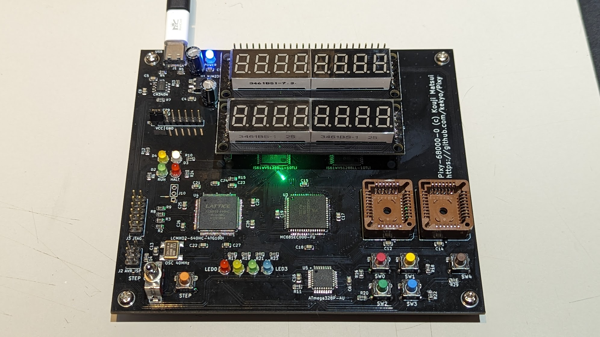
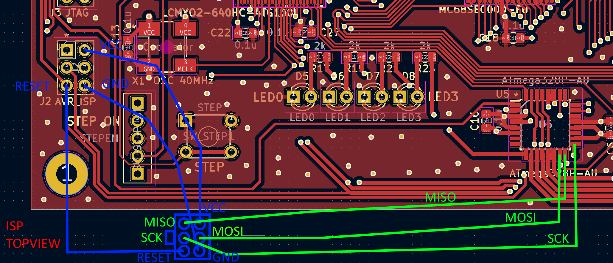
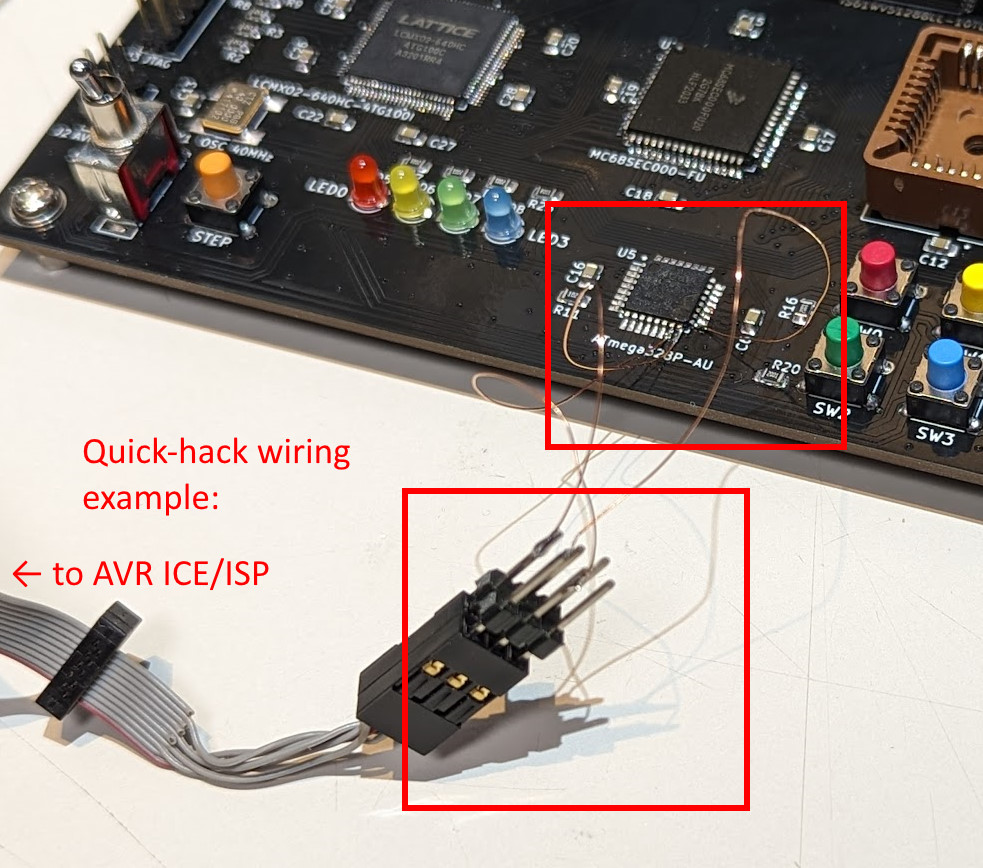
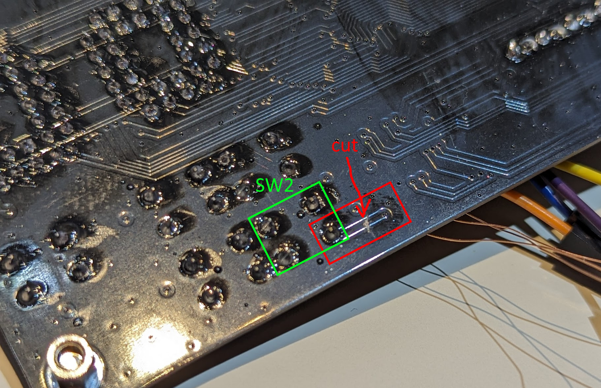
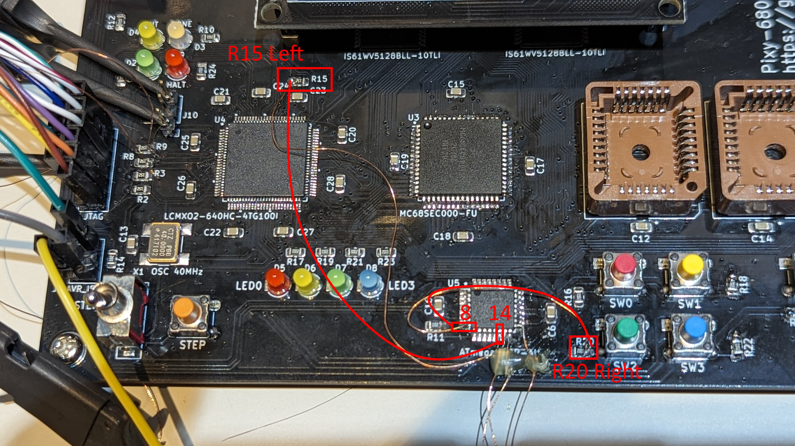

# Pixy-68000-0

## Specification

* [Motorola (NXP Freescale semiconductor) MC68SEC000-20](https://www.nxp.com/docs/en/product-brief/MC68SEC000.pdf) (Static low-powered m68k arch.)
* [ATMEL AVR ATMega-328PB](https://www.microchip.com/en-us/product/atmega328p)
  * Co-processor for 7segLEDs, LEDs, switches and serial interface.
  * Can program Arduino-like with [MiniCore project](https://github.com/MCUdude/MiniCore)
  * It can also be used in "ATMega-328P".
* [LATTICE MachXO2 LCMXO2-640](https://www.latticesemi.com/products/fpgaandcpld/machxo2)
  * Bus controller, captured all signals from the CPU.
* SRAM 1MB (512kbit * 2)
* Flash PROM 1MB (512kbit * 2, PLCC)

## PCB (Pixy-68000-0)

## Schematic (Pixy-68000-0)

[Pixy-68000-0-sch (PDF)](Images/Pixy-68000-0-sch.pdf)

## Errata (Pixy-68000-0)

Will fix these errata in next version (Pixy-68000-1).

1. The `MC68SEC000-20` has very tight soldering due to the narrow pads on the board.
2. Will fail writing Arduino (MiniCore) bootloader at first time.
   Please make this connection in your hand instead of J2 `AVR_ISP` connector.
   Then write to use Arduino MiniCore firmware writer.
   Once the firmware is written, this quick-hack wiring is not required thereafter.
   
   
   
3. The `SPISS` signal is missing.
   Cut the line and additional wiring should be added as follows.
   
   

## TODO:
