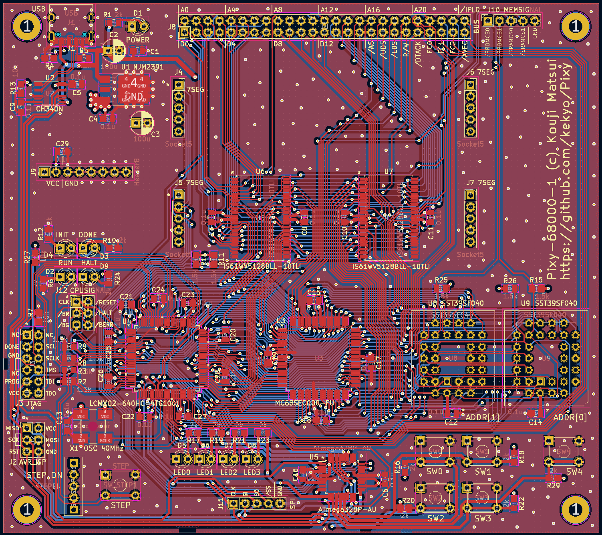

# Pixy-68000-1

Fixed errata for Pixy-68000-0.

## Specification

* Nothing changed between Pixy-68000-0 and Pixy-68000-1.
* Fully compatible FPGA verilog code and firmwares.

## PCB (Pixy-68000-1)

## Schematic (Pixy-68000-1)

[Pixy-68000-1-sch (PDF)](Images/Pixy-68000-1-sch.pdf)

## Other

See [Pixy-68000-0](../Pixy-68000-0/README.md).
