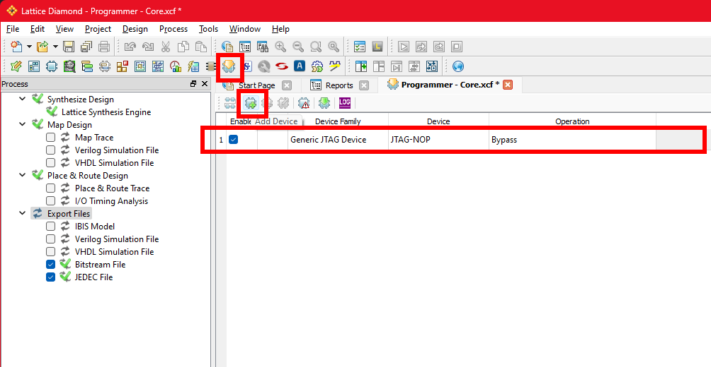
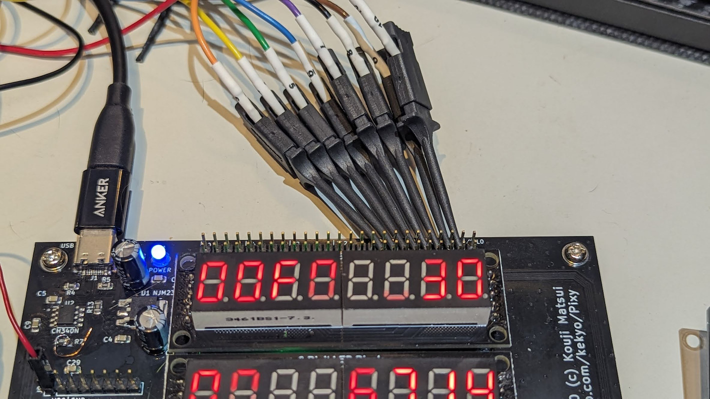

# Pixy-68000-0

## Specification

* [Motorola (NXP Freescale semiconductor) MC68SEC000-20](https://www.nxp.com/docs/en/product-brief/MC68SEC000.pdf) (Static low-powered m68k arch.)
* [ATMEL AVR ATMega-328PB](https://www.microchip.com/en-us/product/atmega328p)
  * Co-processor for 7segLEDs, LEDs, switches and serial interface.
  * Can program Arduino-like with [MiniCore project](https://github.com/MCUdude/MiniCore)
  * It can also be used in "ATMega-328P".
* [LATTICE MachXO2 LCMXO2-640](https://www.latticesemi.com/products/fpgaandcpld/machxo2)
  * Bus controller, captured all signals from the CPU.
* SRAM 1MB (512kbit * 2), no-wait.
* Flash PROM 1MB (512kbit * 2, PLCC), no-wait.

### Features

* We can use the gcc toolchain. In other words, we can write code in C language.

## PCB (Pixy-68000-0)

## Schematic (Pixy-68000-0)

[Pixy-68000-0-sch (PDF)](Images/Pixy-68000-0-sch.pdf)

## Errata (Pixy-68000-0)

Will fix these errata in next version (Pixy-68000-1).

1. The `MC68SEC000-20` has very tight soldering due to the narrow pads on the board.
2. Will fail writing Arduino (MiniCore) bootloader at first time.
   Please make this connection in your hand instead of J2 `AVR_ISP` connector.
   Then write to use Arduino MiniCore firmware writer.
   Once the firmware is written, this quick-hack wiring is not required thereafter.
   
   
3. The `SPISS` signal is missing.
   Cut the line and additional wiring should be added as follows.
   
   
4. Did not avoid data bus confliction before reset complete.
   Add resister 2.2k ohm between `VCC` and `/OE`.
   

## How to enable Pixy-68000-0

1. Solder the all parts/components, taking care to avoid errata.
2. Write bitstream to Lattice MachXO2 FPGA.
   1. You need [Lattice Diamond Software](https://www.latticesemi.com/latticediamond) to build and write FPGA bitstreams.
      Since this project is in the scope of small-scale development, it is free to use. Please download, install, and activate the free license.
   2. Connect the Lattice Programming Cable to the JTAG port.
      The confirmed adapter is [HW-USBN-2B](https://www.latticesemi.com/en/Products/DevelopmentBoardsAndKits/ProgrammingCablesforPCs),
      but if it is recognized by Lattice Diamond, other adapters can also be used for writing.
      The Pixy-68000-0 has Errata, so do not connect anything to pin 11 of the JTAG port, connect to the VCC pin instead.
      The other pins should be connected as they are:
      
      You can use cheaper JTAG adapter FT2232HL/FT4232HL:
      
   3. Open `Fpga.ldf` in [../Fpga/](../Fpga/) directory on Lattice Diamond and build it.
      Since it is difficult to understand how to operate, please refer to the following figure.
      After clicking `Process` tab, check `JEDEC File` and double click `Export Files`, will be built FPGA bitstream:
      
   4. Referring to the figure, open the `Programmer` tab and add a new target device row:
      
   5. In the `Device Family` column, set the target device to `MachXO2`:
      
   6. In the `Device` column, set the model number to `LCMXO2-640HC`:
      
   7. Double-click this line to open the `Device Properties` dialog. Configure as follows.
      The `Fpga_Core.jed` file is the bitstream file you just built. It is generated in the `Pixy-68000-0/Fpga/Core` directory.
      
   8. Clicking on the program writes a bitstream to the FPGA:
      
3. Write CoProcessor firmware on PlatformIO/Arduino based.
   1. Write MegaCore firmware by Arduino at first time, this will make Arduinable ATMega328P.
      
   2. Now we can use PlatformIO for programming. Open [Co-processor firmware project via PlatformIO (Visual Studio Code)](../CoProcessor/Firmware/).
   3. Build and download the co-processor firmware.

### Build the code in 68000

Run gcc toolchain builder, you can use the script [../Firmware/setup.sh](../Firmware/setup.sh).
This script builds the near-latest version of gcc for the m68k architecture.
Just run it to download the necessary files from the respective distribution sites.

TODO:

### Write into the Flash ROMs

* Install the Flash PROM in the following location. Refer to the figure and note the position and direction.
  For some reason, my ROM writer (GQ-4x4) wrote Even and Odd swapped.
  Notice the word sequence of the image loaded into the ROM writer.
  * Even: Lower address in BYTE sequence: 0x000000
  * Odd: Lower+1 address in BYTE sequence: 0x000001
  

### Looper test

This looper test code executes an infinite loop immediately at the entry point.
This is useful if you want to check the address bus or data bus of the 68000 with a logic analyzer, for example.
In other words, if the Pixy-68000-0 does not work immediately after assembly, this code is intended to be used for troubleshooting.

1. Build and write this blinker firmware into Flash PROMs.
   [Blinker firmware](../Firmware/test/blinker/)
2. Power on.

This code does not provide any visible output at all.
However, you will be able to observe the address bus and data bus of the 7-segment LEDs,

You can observe the bus activity using the address bus, data bus, and step execution functions of the 7-segment LEDs.
Or, you can also hook a logic analyzer probe to the header pins on the top of the device to observe the signals in detail:

### LED blinker test

1. Build and write this blinker firmware into Flash PROMs.
   [Blinker firmware](../Firmware/test/blinker/)
2. Power on.
3. Blinks LEDs from LED0 to LED3 repeatedly.

### SRAM checker

1. Build and write this checker firmware into Flash PROMs.
   [SRAM checker firmware](../Firmware/test/sram_check/)
2. Power on.
3. See status LEDs. The test takes about 20 minutes to complete when the CPU clock is 20 MHz.
   

### Serial (UART) tester

The UART on the Pixy-68000-0 is an ATMega328P connected to a CH340N (USB).
It is recognized as a serial device by the PC.
It is transferred from ATMega328P to MachXO2 via SPI and can send/receive data to/from the 68000 CPU.

1. Build and write this test firmware into Flash PROMs.
   [UART tester firmware](../Firmware/test/uart_bridge/)
2. Power on.
3. Connect the serial device to your PC OS and set serial baudrate to 38400.
4. Press `SW0` to `SW3` switch, Then will receive the message `Hello Pixy 0` to `Hello Pixy 3`.
5. Pixy make the echo your sending characters.
