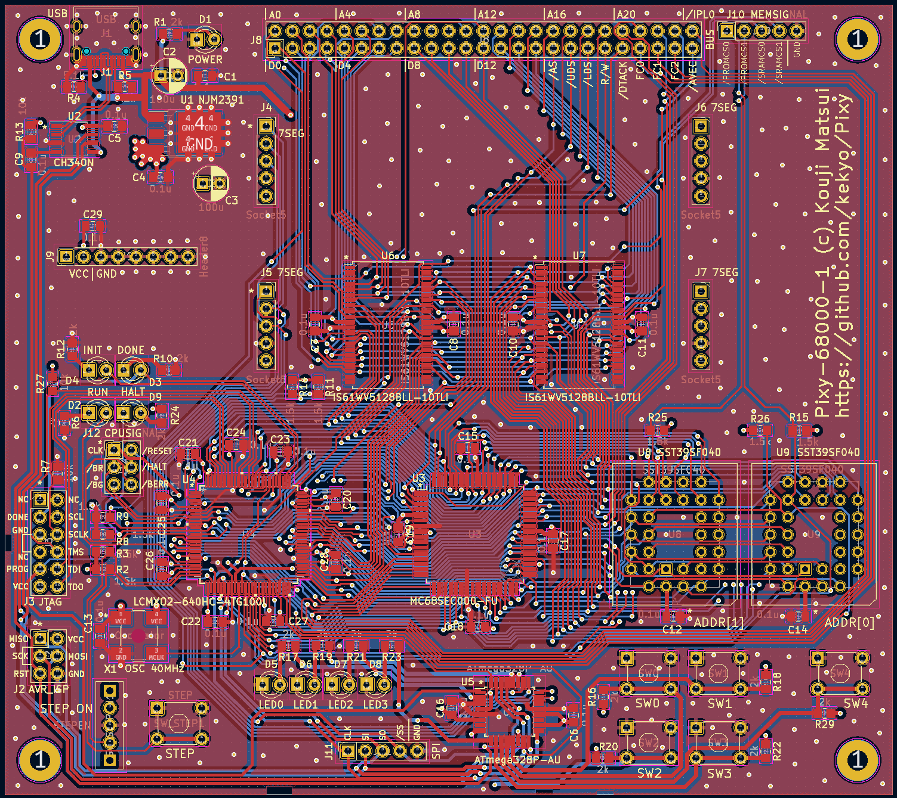

# Pixy-68000-1

Fixed errata for [Pixy-68000-0](../Pixy-68000-0/README.md).

## Specification

Nothing changed between Pixy-68000-0 and Pixy-68000-1.
Fully compatible FPGA verilog code and firmwares.

* [Motorola (NXP Freescale semiconductor) MC68SEC000-20](https://www.nxp.com/docs/en/product-brief/MC68SEC000.pdf) (Static low-powered m68k arch.)
* [ATMEL AVR ATMega-328PB](https://www.microchip.com/en-us/product/atmega328p)
  * Co-processor for 7segLEDs, LEDs, switches and serial interface.
  * Can program Arduino-like with [MiniCore project](https://github.com/MCUdude/MiniCore)
  * It can also be used in "ATMega-328P".
* [LATTICE MachXO2 LCMXO2-640](https://www.latticesemi.com/products/fpgaandcpld/machxo2)
  * Bus controller, captured all signals from the CPU.
* SRAM 1MB (512kbit * 2), no-wait.
* Flash PROM 1MB (512kbit * 2, PLCC), no-wait.

### Features

* We can use the gcc toolchain. In other words, we can write code in C language.

## PCB (Pixy-68000-1)

## Schematic (Pixy-68000-1)

[Pixy-68000-1-sch (PDF)](Images/Pixy-68000-1-sch.pdf)
