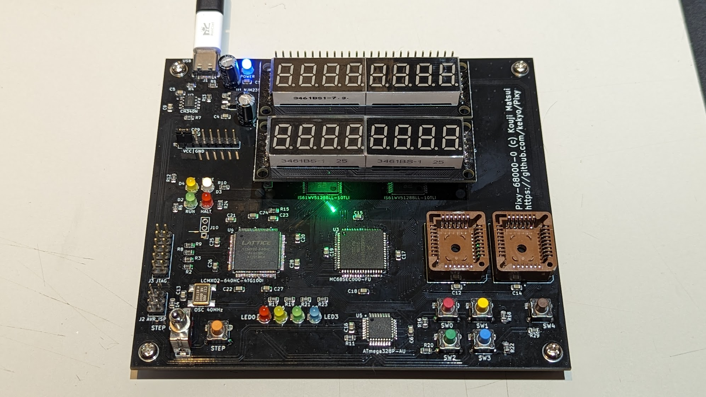
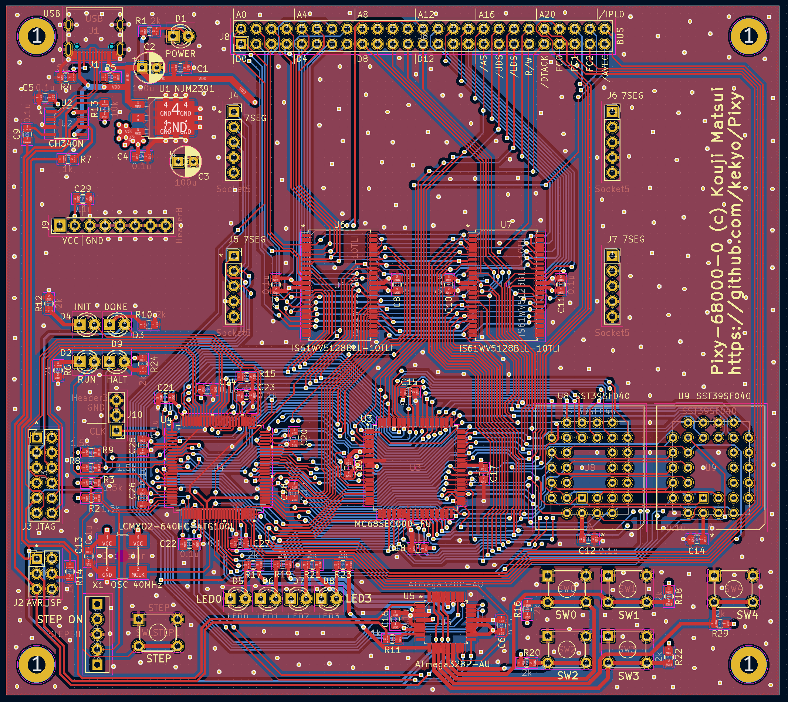

# Pixy-68000

## Specification

* [Motorola (NXP Freescale semiconductor) MC68SEC000-20](https://www.nxp.com/docs/en/product-brief/MC68SEC000.pdf) (Static low-powered m68k arch.)
* [ATMEL AVR ATMega-328P](https://www.microchip.com/en-us/product/atmega328p)
  * Co-processor for 7segLEDs, LEDs, switches and serial interface.
* [LATTICE MachXO2 LCMXO2-640](https://www.latticesemi.com/products/fpgaandcpld/machxo2)
  * Bus controller, captured all signals from the CPU.
* SRAM 1MB (512kbit * 2)
* Flash PROM 1MB (512kbit * 2, PLCC)

## PCB (Pixy-68000-0)

## Schematic (Pixy-68000-0)

[Pixy-68000-0-sch (PDF)](Images/Pixy-68000-0-sch.pdf)

## Errata (Pixy-68000-0)

TODO:

## TODO:
