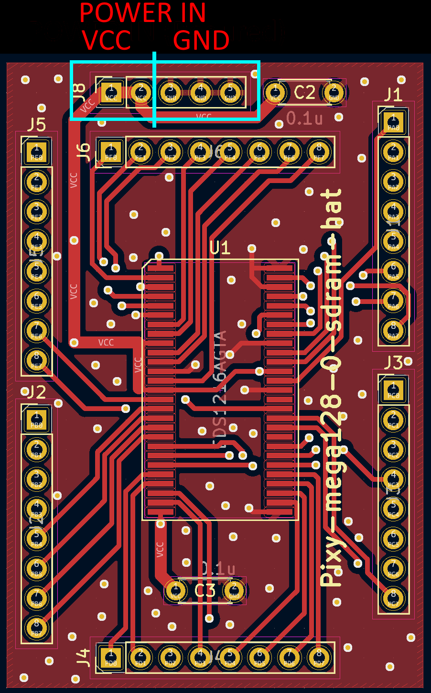

# Pixy-mega128-sdram-hat

## Specification

* SDRAM hat for Pixy-mega128-0
* EXPERIMENTAL circuit board, designed for learning SDRAM.
  * Not suitable for application use because Arduino cannot control it at a practical level.
  * Lack of any capacitors and position is undesirable. Therefore, high-speed access is not possible.

TODO:

## PCB (Pixy-mega128-0)

## Sample code

TODO:
