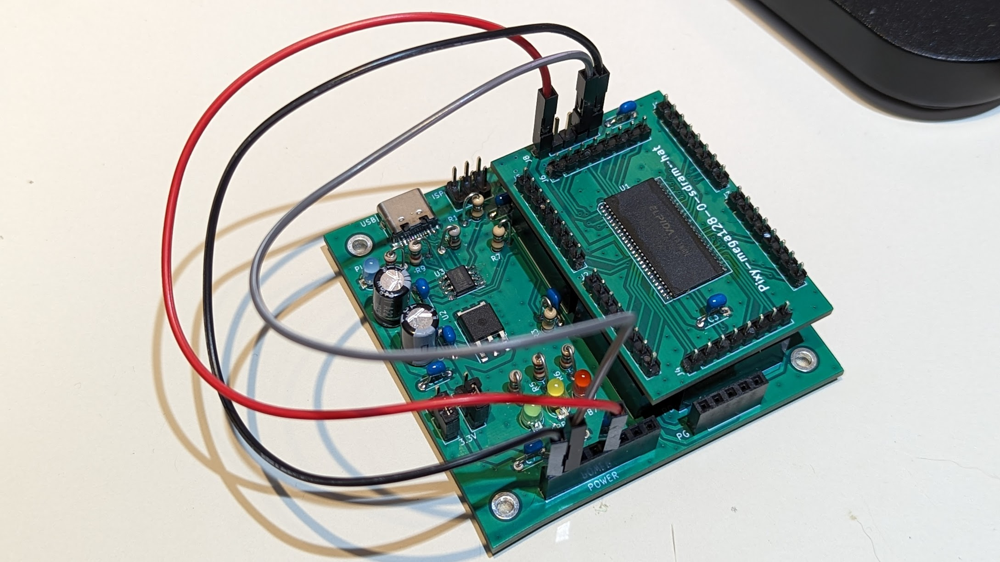

# Pixy-mega128-sdram-hat

## Specification

* SDRAM hat for `Pixy-mega128-0`.
* EXPERIMENTAL circuit board, designed for learning SDRAM.
  * Not suitable for application use because Arduino (ATMega128A) cannot control it at a practical level.
  * Lack of any capacitors and position is undesirable. Therefore, high-speed access is not possible.
* SDRAM: ELPIDA EDS1216AGTA (16MB: 8Mwords * 16bits)

## PCB (Hat on Pixy-mega128-0)

## Note

* Errata: The header is slightly misaligned in version 0. You must force this board to be inserted onto `Pixy-mega128-0`.
* You have to connect both VCC and GND before connect USB. See the picture.
  

## Sample code

[SdramHat](SdramHat/): PlatformIO project. Will test SDRAM initialization and write-to-read.
