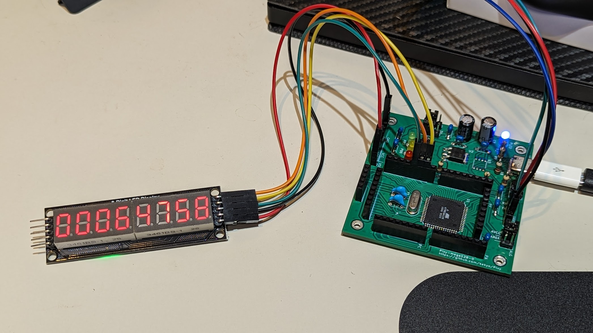

# Pixy-mega128

## Specification

* [ATMEL ATMega128-16AU](https://www.microchip.com/en-us/product/atmega128) (Simplest 48+ GPIO)
* Enabled Arduino IDE with [MCUdude/MegaCore](https://github.com/MCUdude/MegaCore).
* PB5, PB6 and PB7 are assigned LEDs. (PB5 LED is MegaCore standard.)
* PE0 is TX, PE1 is RX and PB1 is SCK. These pins are set of ATMEL AVR ICE/ISP and UART interfaces.
  * ISP header is compatible for genuine [ATMEL AVR ICE/ISP](https://www.microchip.com/en-us/development-tool/atatmel-ice).
  * You have to use ATMEL AVR ICE/ISP on first time Arduino (MegaCore) firmware download.
  * UART header is requied only use for your own serial port interface instead of U3 (WCH CH340N).

## PCB (Pixy-mega128-0)


## Sample code

### Blinker

Blinker for Onboard LEDs (PB5, PB6 and PB7)

```c
#include <Arduino.h>

int count = 0;

void setup() {
  Serial.begin(115200);
  Serial.println("setup()");
  
  pinMode(PIN_PB5, OUTPUT);
  pinMode(PIN_PB6, OUTPUT);
  pinMode(PIN_PB7, OUTPUT);
}

void loop() {
  Serial.println("Hello World! " + String(count));
  int v = count & 0x07;
  
  if (v & 0x01)
    digitalWrite(PIN_PB5, HIGH);
  else
    digitalWrite(PIN_PB5, LOW);

  if (v & 0x02)
    digitalWrite(PIN_PB6, HIGH);
  else
    digitalWrite(PIN_PB6, LOW);
  
  if (v & 0x04)
    digitalWrite(PIN_PB7, HIGH);
  else
    digitalWrite(PIN_PB7, LOW);

  delay(500);
  count++;
}
```

### Cheaper 7segment 8digits LED

Bought this LED module by: [0.36 inch 8digit 74HC595 version](https://www.ebay.com/itm/334240929966?var=543243005124)

```c
#include <Arduino.h>

#define DIO     PIN_PB2
#define SCLK    PIN_PB1
#define RCLK    PIN_PB3

static const byte digitPatterns[16] = {
  B11000000,  // 0
  B11111001,  // 1
  B10100100,  // 2
  B10110000,  // 3
  B10011001,  // 4
  B10010010,  // 5
  B10000010,  // 6
  B11111000,  // 7
  B10000000,  // 8
  B10010000,  // 9
  B10001000,  // a
  B10000011,  // b
  B11000110,  // c
  B10100001,  // d
  B10000110,  // e
  B10001110   // f
};

void setup() {
  Serial.begin(115200);
  Serial.println("setup()");
  
  pinMode(PIN_PB5, OUTPUT);
  pinMode(PIN_PB6, OUTPUT);
  pinMode(PIN_PB7, OUTPUT);

  pinMode(DIO, OUTPUT);
  pinMode(SCLK, OUTPUT);
  pinMode(RCLK, OUTPUT);

  digitalWrite(SCLK, HIGH);
  digitalWrite(RCLK, HIGH);
}

static void outputBits(byte value) {
  for (int j = 0; j < 8; j++) {
    digitalWrite(DIO, (value & 0x80) ? HIGH : LOW);
    digitalWrite(SCLK, LOW);
    digitalWrite(SCLK, HIGH);
    value <<= 1;
  }
}

static void flush() {
    digitalWrite(RCLK, LOW);
    digitalWrite(RCLK, HIGH);
}

static void output4Segments(uint16_t value, bool isHigh) {
  byte column = isHigh ? 0x80 : 0x08;
  for (int i = 0; i < 4; i++) {
    // Makes value bits
    byte v0 = digitPatterns[value & 0x0f];
    outputBits(v0);
    // Makes column bits
    outputBits(column);
    value >>= 4;
    column >>= 1;
    flush();
  }
}

static uint32_t value = 0;

void loop() {
  //Serial.println("Value: " + String((unsigned int)value));

  output4Segments((value >> 16) & 0xffffffff, true);
  output4Segments(value & 0xffffffff, false);

  outputBits(0);
  outputBits(0);
  flush();

  //digitalWrite(PIN_PB5, (value & 0x01) ? HIGH : LOW);
  //digitalWrite(PIN_PB6, (value & 0x02) ? HIGH : LOW);
  //digitalWrite(PIN_PB7, (value & 0x04) ? HIGH : LOW);

  value++;
}
```


