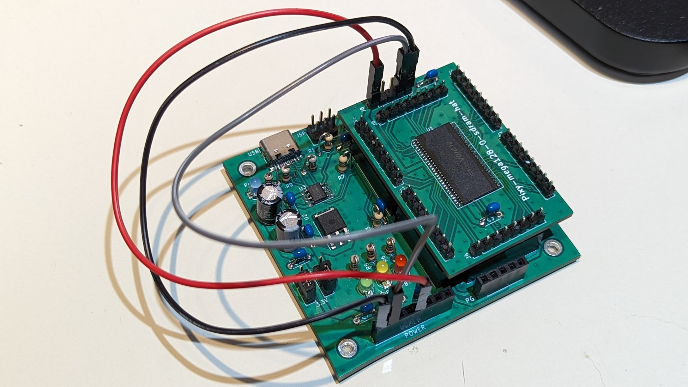

# Pixy - SBC projects

## What is this?

My own SBC projects.

## Pixy-mega128

[Project readme](Pixy-mega128/README.md)

* ATMEL ATMega128-16AU (Simplest 48+ GPIO)
* Enabled Arduino IDE with MegaCore.

Assembled (Pixy-mega128-0):

## Pixy-mega128-sdram-hat

[Project readme](Pixy-mega128-sdram-hat/README.md)

* SDRAM: ELPIDA EDS1216AGTA (16MB: 8Mwords * 16bit)
* EXPERIMENTAL circuit board for learning how to use SDRAM.

Assembled (Pixy-mega128-sdram-hat-0):

## License

Apache-V2
