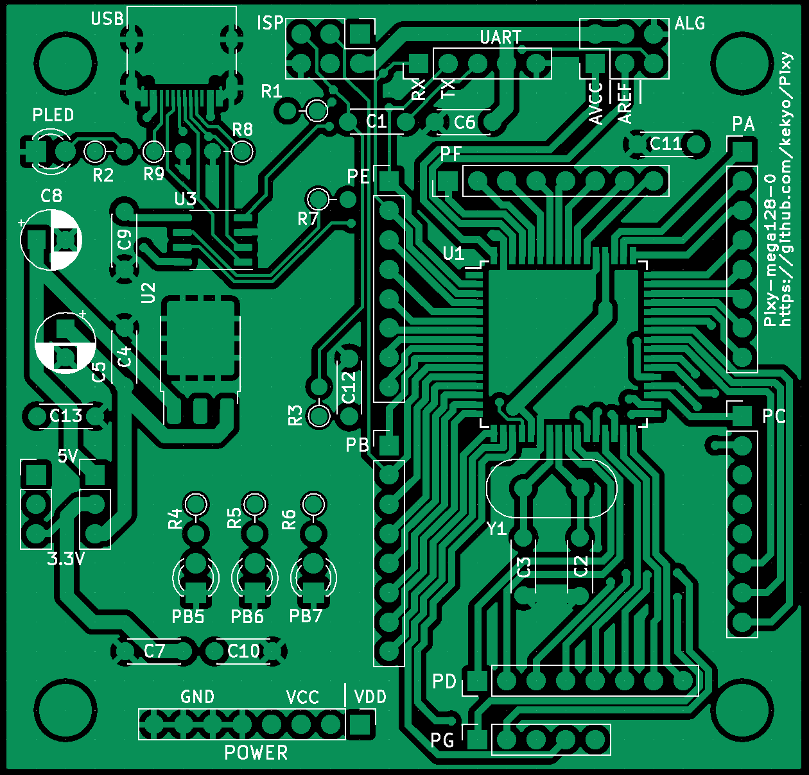
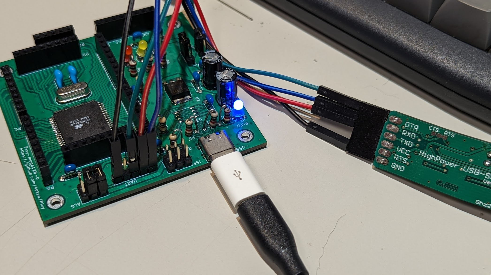

# Pixy - SBC projects

## What is this?

My own SBC projects.

## Pixy-mega128

[Project (KiCad)](Pixy-mega128/)

* [ATMEL ATMega128-16AU](https://www.microchip.com/en-us/product/atmega128) (Simplest 48+ GPIO)
* Enabled Arduino IDE with [MCUdude/MegaCore](https://github.com/MCUdude/MegaCore).
* PB5, PB6 and PB7 are assigned LEDs. (PB5 LED is MegaCore standard.)
* PE0 is TX, PE1 is RX and PB1 is SCK. These pins are set of ATMEL AVR ICE/ISP and UART interfaces.
  * ISP header is compatible for genuine [ATMEL AVR ICE/ISP](https://www.microchip.com/en-us/development-tool/atatmel-ice).
  * You have to use ATMEL AVR ICE/ISP on first time Arduino (MegaCore) firmware download.
  * UART header is requied only use for your own serial port interface instead of U3 (WCH CH340N).

PCB (Pixy-mega128-0):



Assembled (Pixy-mega128-0):



Blinker:

```c
int count = 0;

void setup() {
  Serial.begin(115200);
  Serial.println("setup()");
  
  pinMode(PIN_PB5, OUTPUT);
  pinMode(PIN_PB6, OUTPUT);
  pinMode(PIN_PB7, OUTPUT);
}

void loop() {
  Serial.println("Hello World! " + String(count));
  int v = count & 0x07;
  
  if (v & 0x01)
    digitalWrite(PIN_PB5, HIGH);
  else
    digitalWrite(PIN_PB5, LOW);

  if (v & 0x02)
    digitalWrite(PIN_PB6, HIGH);
  else
    digitalWrite(PIN_PB6, LOW);
  
  if (v & 0x04)
    digitalWrite(PIN_PB7, HIGH);
  else
    digitalWrite(PIN_PB7, LOW);

  delay(500);
  count++;
}
```

## License

Apache-V2
