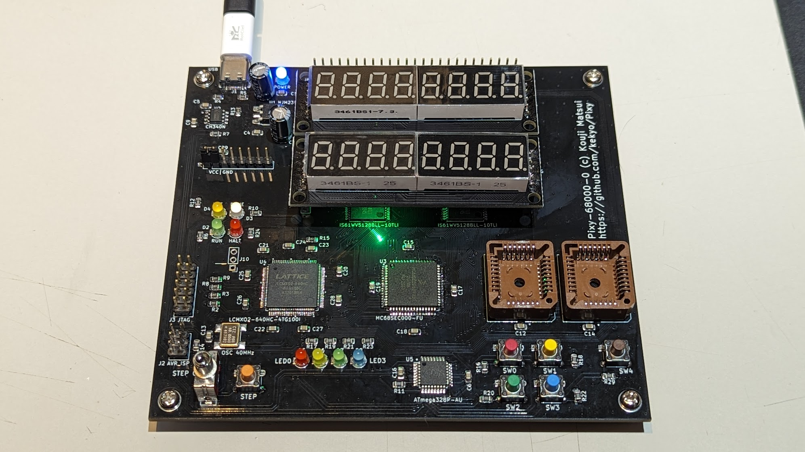

# Pixy - Single board computer projects

## What is this?

My owned single board computer projects.

----

## Pixy-68000

[Pixy-68000-1 project readme](Pixy-68000/Pixy-68000-1/README.md)

[Pixy-68000-0 project readme](Pixy-68000/Pixy-68000-0/README.md)

* Motorola MC68SEC000-20 (Static low-powered m68k arch.)
* ATMEL AVR ATMega-328PB
  * Co-processor for 7segLEDs, LEDs, switches and serial interface.
* LATTICE MachXO2 LCMXO2-640
  * Bus controller, captured all signals from the CPU.
* SRAM 1MB (512kbit * 2)
* Flash PROM 1MB (512kbit * 2, PLCC)

Assembled (Pixy-68000-0):

----

## Pixy-mega128

[Project readme](Pixy-mega128/README.md)

* ATMEL ATMega128-16AU (Simplest 48+ GPIO)
* Enabled Arduino IDE with MegaCore.

Assembled (Pixy-mega128-0):

## Pixy-mega128-sdram-hat

[Project readme](Pixy-mega128-sdram-hat/README.md)

* SDRAM: ELPIDA EDS1216AGTA (16MB: 8Mwords * 16bit)
* EXPERIMENTAL circuit board for learning how to use SDRAM.

Assembled (Pixy-mega128-sdram-hat-0):

## License

Apache-V2
